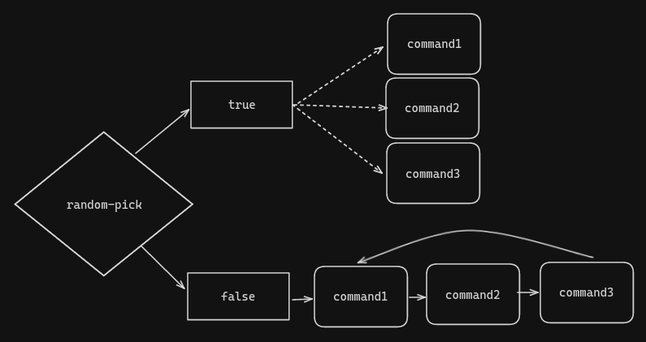

# Simple Announcer, Not A Lychee
Just a simple python script to send messages depending on time.

## Features

- Start/stop key.
- JSON configuration file.
- Random or chain of messages support.
- Custom key bindings.
- Random extra time.

## Setting up your commands

In the .json file you will give the groups any string name containing one of the objects below.

### Single command group format

| Field | Type | Default |  Description |
| -- | -- | -- | -- |
| `command` | String | _semi-optional_ | The message or command that will be sent. |
| `delay` | Integer | `1` | Time to wait in seconds. |
| `random_wait` | Boolean | `false` | Random range to wait in the profile file. |
| `random_time` | Float or Integer | _profile default_ | When set, it overrites the profile `random_time` |

### Multiple commands group format

| Field            | Type            | Default         | Description                                                                             |
|------------------|-----------------|-----------------|-----------------------------------------------------------------------------------------|
| `commands`       | List of Strings | _semi-optional_ | Commands or messages to send                                                            |
| `delay`          | Integer         | `30`            | Time to wait in seconds.                                                                |
| `random_wait`    | Boolean         | `false`         | Random range to wait in the profile file.                                               |
| `random_pick`    | Boolean         | `false`         | When it's false, it will execute the commands in order, otherwise they'll run randomly. |
| `chain_step_time` | Integer         | null            | When set, it will set the time to wait for each chain step, plus a fraction.            | 
| `random_time` | Float or Integer | _profile default_ | When set, it overrites the profile `random_time` |



## Setting up your profile

Here you can set your own bindings, and the range of time that you wish to add to each message.
> [!CAUTION]
> Not setting a **Field** will result in a error.

| Field | Type | Description |
| -- | -- | -- |
| `start_key` | String | Key to start sending messages |
| `stop_key` | String | Key to send the last messages |
| `random_time` | Float or Integer | Extra time to simulate realism |

## Installation

### Clone the repository
```bash
git clone https://github.com/Curant0/sanal-macro
cd ./sanal-macro
```

### Create and activate a virtual environment\*
\**(Optional, but recommended)*
```bash
python -m venv venv
source ./venv/bin/activate
```

### Install modules
```bash
pip install -r requirements.txt
```

## Usage

In the folder, activate the venv if installed, and then use.
```bash
python main.py [command] [profile]
```

With `command` and `profile` with the file names in their respective folders, without extension.

**Example**
```bash
python main.py my_commands my_config
```

## Issues
This being a 1 day script, I didn't gave too much effort to it, but any help and suggestions would be great!


